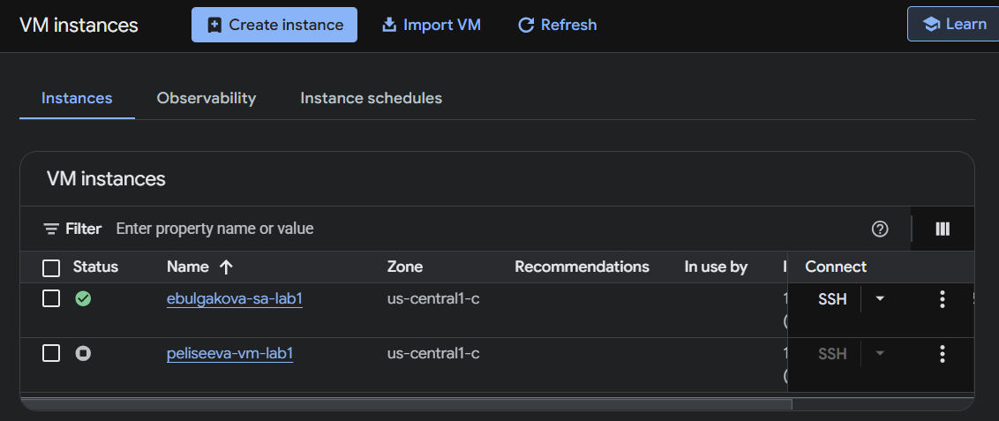
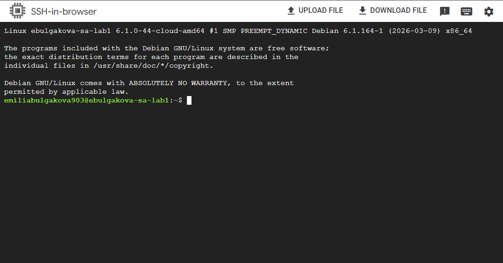
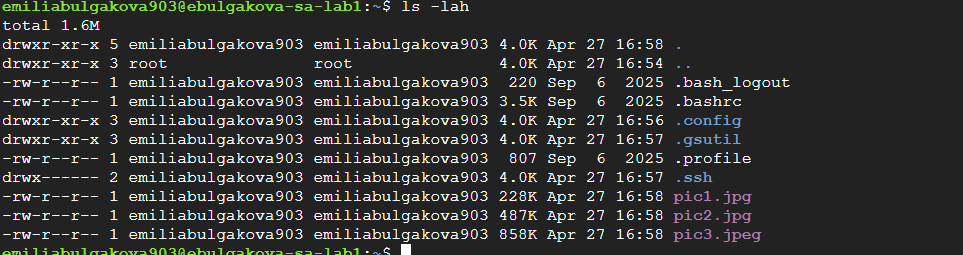
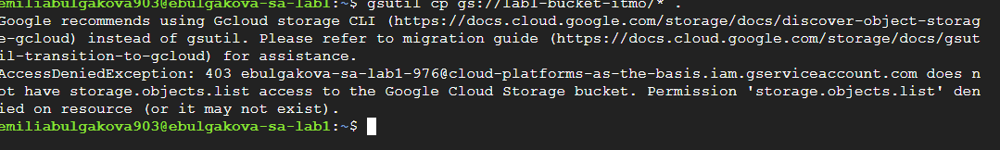

University: \[ITMO University](https://itmo.ru/ru/)

Faculty: \[FICT](https://fict.itmo.ru)

Course: \[Облачные платформы как основа технологического предпринимательства](https://itmo-ict-faculty.github.io/cloud-platforms-as-the-basis-of-technology-entrepreneurship/)

Year: 2025/2026

Group: U4125

Author: Булгакова Емилия Валерьевна

Lab: Lab2

Date of create: 28.04.2026

Date of finished: 28.04.2026

\---

\### 1. Цель работы

Ознакомление с интерфейсом Google Cloud Platform (GCP), создание сервисного аккаунта, развертывание виртуальной машины Compute Engine и исследование механизмов управления доступом (IAM).

\---

\### 2. Ход работы

\#### Шаг 1. Создание Service Account

Был создан сервисный аккаунт с именем `ebulgakova-sa-lab1`. На этапе настройки ему была назначена роль \*\*Storage Admin\*\*, необходимая для работы с облачными хранилищами.

\*Рисунок 1 — Назначение роли Storage Admin для ebulgakova-sa-lab1\*

\#### Шаг 2. Конфигурация виртуальной машины (Compute Engine)

Создана виртуальная машина со следующими характеристиками:

\* \*\*Имя:\*\* `ebulgakova-vm-lab1`

\* \*\*Тип машины:\*\* `e2-micro`

\* \*\*Режим:\*\* `Spot` (прерываемая ВМ)

\* \*\*Identity:\*\* Привязан созданный ранее Service Account.

\*Рисунок 2 — Настройки виртуальной машины перед запуском\*

\#### Шаг 3. Работа с данными в терминале

После подключения к VM по SSH, были выполнены команды для взаимодействия с бакетом `lab1-bucket-itmo`. Файлы были успешно скопированы в локальную директорию.

\*Рисунок 3 — Результат выполнения команды ls -lah после копирования данных\*

\#### Шаг 4. Проверка ограничений доступа (IAM)

Роль сервисного аккаунта была изменена на \*\*Compute Viewer\*\*. При попытке повторного доступа к бакету система выдала ошибку, подтверждающую ограничение прав.

\*Рисунок 4 — Ошибка AccessDeniedException (403) при попытке обращения к хранилищу\*

\---

\### 3. Вывод

В ходе выполнения работы были изучены основы работы с GCP. Практическим путем подтверждена эффективность управления доступом через сервис-аккаунты: изменение роли в панели IAM мгновенно (с учетом времени кэширования) влияет на возможности ВМ по работе с внешними сервисами.

\---

\### 4. Очистка ресурсов

После завершения экспериментов виртуальная машина и сервисный аккаунт были удалены для предотвращения лишних затрат.

