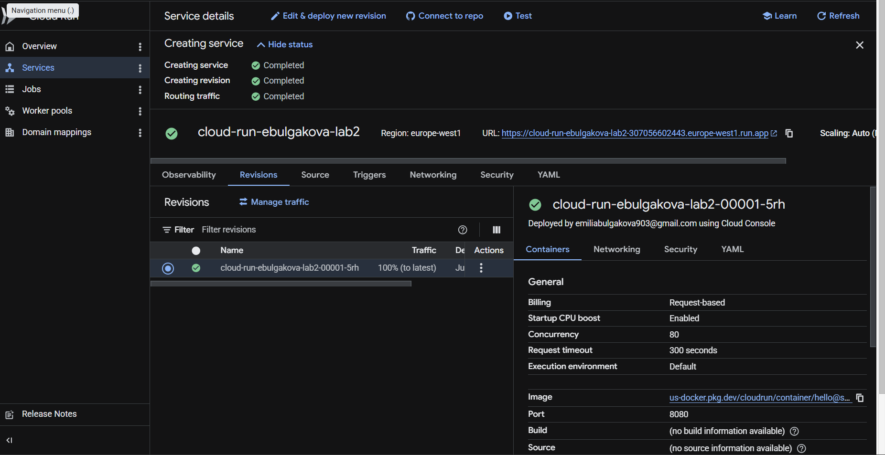
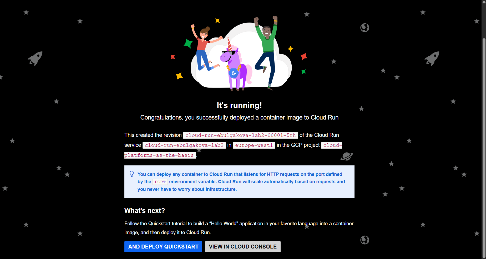
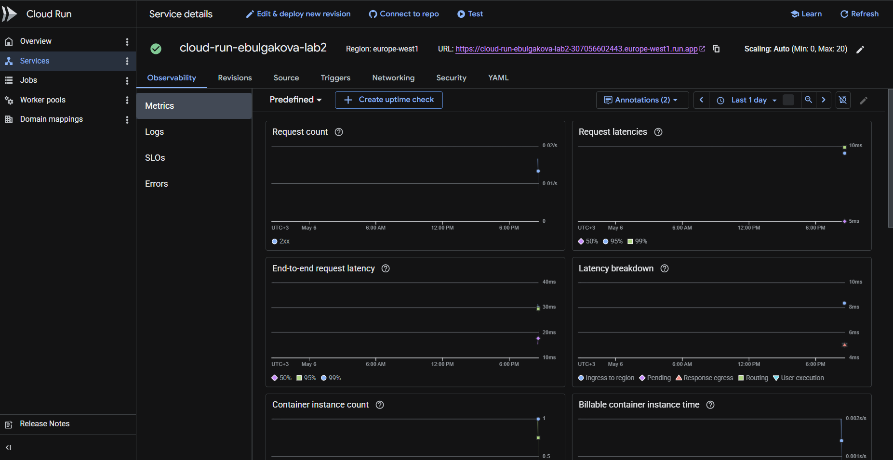
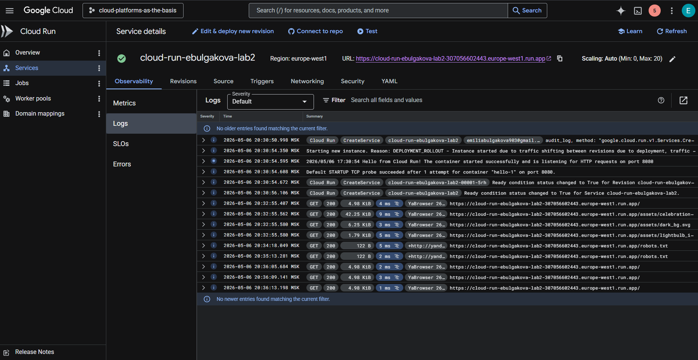
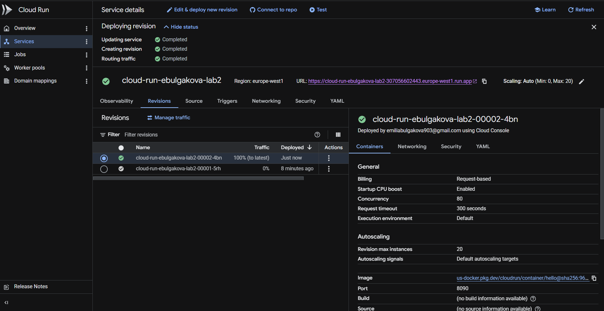
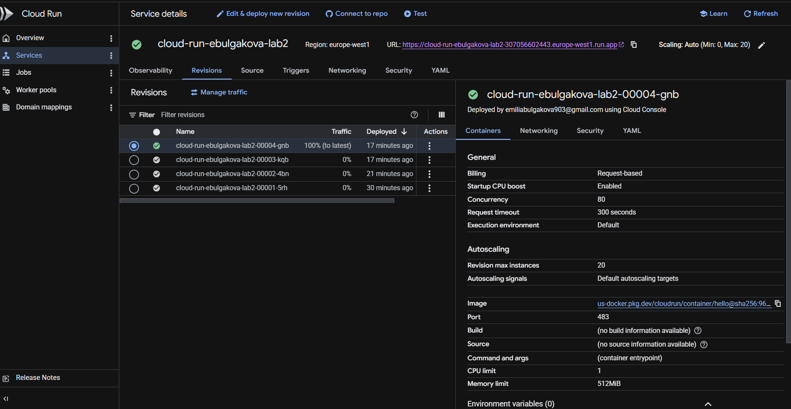
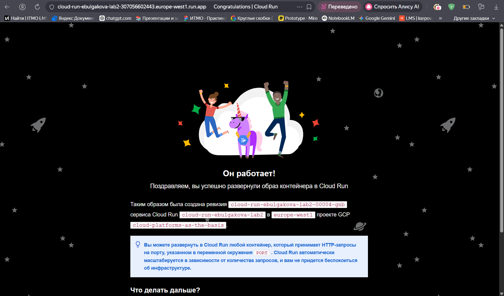
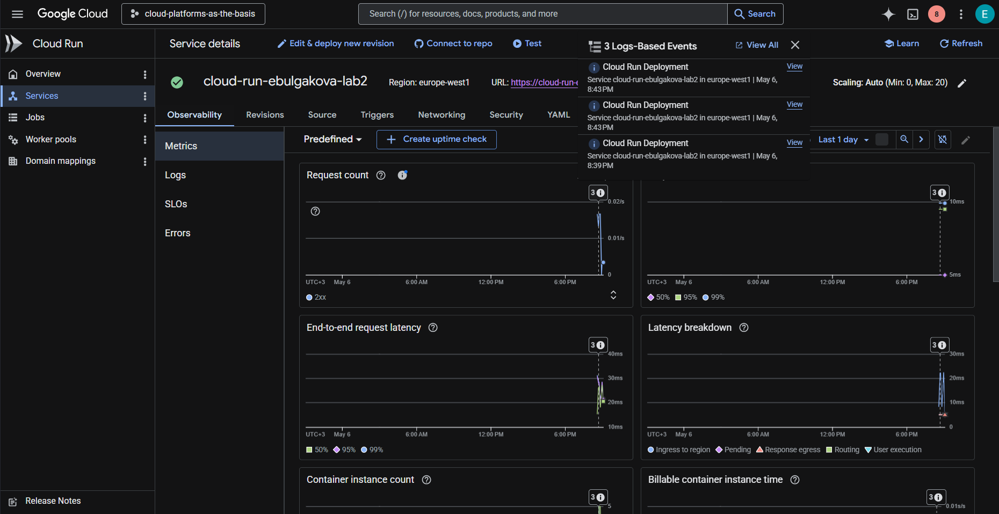
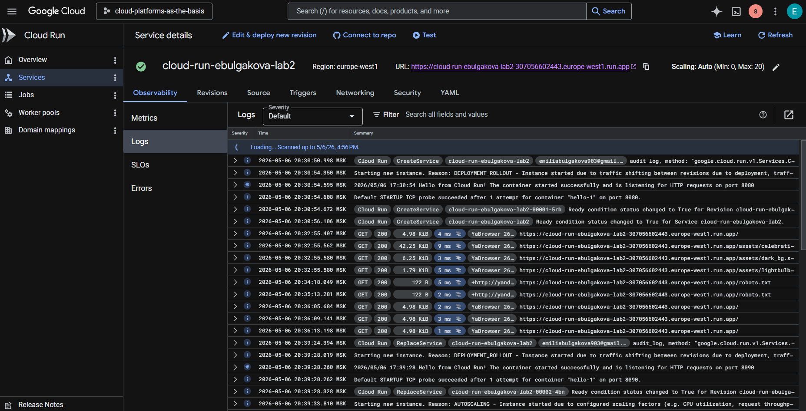

University: \[ITMO University](https://itmo.ru/ru/)

Faculty: \[FICT](https://fict.itmo.ru)

Course: \[Облачные платформы как основа технологического предпринимательства](https://itmo-ict-faculty.github.io/cloud-platforms-as-the-basis-of-technology-entrepreneurship/)

Year: 2025/2026

Group: U4125

Author: Булгакова Емилия Валерьевна

Lab: Lab2

Date of create: 06.05.2026

Date of finished: 08.05.2026

## 1. Цель работы
Ознакомление с принципами работы Serverless-платформы Cloud Run, изучение механизмов деплоя, управления ревизиями, анализа метрик и настройки сетевых портов контейнера.

---

## 2. Ход работы

### Шаг 1. Развертывание сервиса
Был создан сервис под названием `cloud-run-ebulgakova-lab2`. Для начального деплоя использовался стандартный образ. Ресурсы были ограничены до минимальных значений для оптимизации затрат.

*Рисунок 1 — Процесс настройки и создания Cloud Run сервиса*

### Шаг 2. Проверка первой ревизии
Первая ревизия `cloud-run-ebulgakova-lab2-00001-5rh` была запущена на стандартном порту 8080. Сервис успешно открылся по предоставленному URL.

*Рисунок 2 — Успешная работа приложения на порту 8080*

### Шаг 3. Анализ метрик и логов
После нескольких обращений к сервису были проанализированы инструменты мониторинга. 
* В разделе **Metrics** зафиксированы входящие запросы и время обработки.
* В разделе **Logs** отображены системные сообщения и логи доступа (GET запросы).

*Рисунок 3 — Мониторинг ресурсов и количества запросов*

*Рисунок 4 — Журнал событий и логи контейнера*

### Шаг 4. Эксперименты с портами (8090, 483)
Была произведена попытка изменения порта контейнера на 8090, а затем на 483. 

*Рисунок 5 — Изменение порта в конфигурации ревизии*

В ходе эксперимента было замечено, что даже при изменении порта на 483, сервис продолжал успешно работать и принимать трафик (100% Traffic на последней ревизии). 

*Рисунок 6 — Список из четырех ревизий, последняя активна на порту 483*

*Рисунок 7 — Доступность сайта при нестандартном порте*

**Анализ результата:** Приложение успешно адаптировалось к смене портов, так как использует переменную окружения `$PORT`. Система Cloud Run динамически передает значение порта внутрь контейнера, что позволяет избежать ошибок рассогласования (Mismatch), если приложение поддерживает чтение порта из окружения.

### Шаг 5. Финальный мониторинг
После проведения тестов с распределением трафика были повторно проверены метрики и логи для подтверждения стабильности работы всех созданных ревизий.

*Рисунок 8 — Итоговые показатели нагрузки*

*Рисунок 9 — Подтверждение успешной обработки запросов на порту 483*

---

## 3. Вывод
В ходе работы была изучена платформа Cloud Run. Практическим путем доказана эффективность использования переменных окружения (`$PORT`) для обеспечения гибкости сетевых настроек. Также был освоен механизм управления ревизиями, позволяющий бесшовно обновлять конфигурацию сервиса без прерывания его доступности.

---
## 4. Очистка ресурсов
После выполнения работы сервис `cloud-run-ebulgakova-lab2` был удален во избежание нецелевого расходования лимитов.