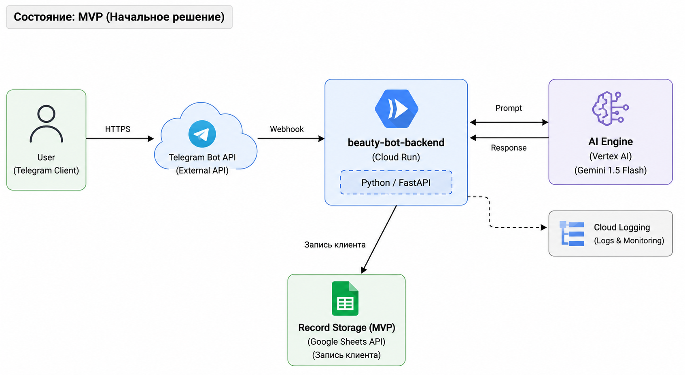

University: \[ITMO University](https://itmo.ru/ru/)

Faculty: \[FICT](https://fict.itmo.ru)

Course: \[Облачные платформы как основа технологического предпринимательства](https://itmo-ict-faculty.github.io/cloud-platforms-as-the-basis-of-technology-entrepreneurship/)

Year: 2025/2026

Group: U4125

Author: Булгакова Емилия Валерьевна

Lab: Lab4

Date of create: 07.05.2026

Date of finished: 08.05.2026

!\[Создание сервисного аккаунта](screenshots/ф1.png)

1. ЦЕЛЬ РАБОТЫ
Создать масштабируемую архитектуру для AI-ассистента салона красоты, способную адаптироваться к росту нагрузки от 500 до 50 000 пользователей в месяц, с расчетом экономической эффективности.

2. ОПИСАНИЕ СЦЕНАРИЯ
Приложение "BeautyBot" автоматизирует запись клиентов, анализирует фотографии для подбора процедур и отвечает на вопросы по уходу за собой.

3. ПОДРОБНОЕ ОПИСАНИЕ ИНФРАСТРУКТУРНЫХ СХЕМ

На данном этапе архитектура максимально упрощена для минимизации затрат.
- Входная точка: Пользователь взаимодействует через Telegram Bot API.
- Вычислительный слой: Cloud Run (Serverless). Контейнер с логикой на Python запускается только при поступлении запроса (Webhook), что исключает оплату за простой.
- AI Мозг: Vertex AI (Gemini 1.5 Flash). Используется для обработки текста и фотографий. Flash-версия выбрана из-за высокой скорости и низкой стоимости.
- Хранение данных: Google Sheets API. Записи о клиентах сохраняются в облачную таблицу, что позволяет владельцу салона видеть журнал записей в реальном времени без внедрения сложной админ-панели.
- Логирование: Cloud Logging автоматически собирает системные отчеты.

--- СОСТОЯНИЕ 2: ТЕСТИРОВАНИЕ ПАРТНЕРАМИ ---

!\[тесты](screenshots/d2.png)

Система становится надежнее и безопаснее для работы с первыми партнерами.
- База данных: Переход на Cloud SQL (PostgreSQL). Это необходимо для транзакционности (чтобы двое клиентов не записались на одно время) и хранения истории предпочтений.
- Безопасность: Внедрен Secret Manager. API-ключи Telegram и доступы к базе больше не хранятся в коде, а запрашиваются динамически.
- Хранение медиа: Cloud Storage. Используется для хранения фотографий клиентов, которые они присылают боту для консультаций.
- Обновление модели: Использование Gemini 1.5 Pro для более точных и развернутых консультаций.

--- СОСТОЯНИЕ 3: ПРОДАКШН-РЕШЕНИЕ ---

!\[прод](screenshots/d3.png)

Архитектура корпоративного уровня для сети салонов.
- Edge Layer (Безопасность): Cloud Armor защищает от DDoS-атак, а Load Balancing (балансировщик нагрузки) распределяет трафик между регионами.
- Application Layer: Cloud Run переведен в режим автоскейлинга (1-10 инстансов), обеспечивая работу без задержек при наплыве пользователей.
- AI/Knowledge Base: Vertex AI Search & Conversation (RAG). Бот обучается на внутренних документах салона (прайсы, должностные инструкции), предоставляя экспертные ответы.
- Аналитический слой: BigQuery. Все данные о записях и вопросах клиентов стекаются в хранилище для построения маркетинговых отчетов.
- Уведомления: Cloud Pub/Sub используется для асинхронной рассылки напоминаний о записи (SMS/Push), чтобы не нагружать основной поток приложения.

4. ОБОСНОВАНИЕ ВЫБОРА РЕСУРСОВ
1. Cloud Run: Позволяет платить только за время обработки запроса. Для салона красоты, где записи редки ночью, это экономит до 70% бюджета.
2. Vertex AI API: Исключает необходимость аренды серверов с GPU (которые стоят от $1000/мес), заменяя их оплатой по факту использования модели.
3. BigQuery: Позволяет владельцу бизнеса видеть аналитику (например, "какие услуги чаще ищут в среду") за копейки на малых объемах данных.

5. ЭКОНОМИЧЕСКАЯ ЭФФЕКТИВНОСТЬ
| Категория расходов   | Статья (Ресурс)        | MVP ($) | Testing ($) | Production ($) | Логика и обоснование затрат                                   |
|----------------------|------------------------|---------|-------------|----------------|---------------------------------------------------------------|
| Вычисления           | Cloud Run              | 0.55    | 4.80        | 22.50          | Оплата за vCPU/RAM. В MVP почти весь объем в Free Tier.       |
| Интеллект (AI)       | Vertex AI API          | 1.80    | 12.00       | 75.00          | MVP: Gemini Flash. Prod: Gemini Pro + RAG система.            |
| Базы данных          | Cloud SQL              | 0.00    | 11.20       | 135.00         | MVP: G-Sheets. Test: f1-micro. Prod: High Availability (HA).  |
| Хранение данных      | Cloud Storage          | 0.00    | 0.50        | 5.00           | Хранение фото клиентов для консультаций.                      |
| Сеть и защита        | Networking / Armor     | 0.00    | 5.50        | 30.00          | Cloud Armor и Load Balancer для защиты и стабильности.        |
| Аналитика            | BigQuery               | 0.00    | 0.00        | 45.00          | Сбор логов и маркетинговые отчеты (оплата за объем).          |
| Безопасность         | Secret Manager         | 0.00    | 0.00        | 0.30           | Оплата за хранение активных токенов доступа.                  |
| -------------------- | ---------------------- | ------- | ----------- | -------------- | ------------------------------------------------------------- |
| ИТОГО                |                        | $2.35   | $34.00      | $312.80        | Ежемесячный бюджет на содержание инфраструктуры.              |
ВЫВОД:
Выбранный стек технологий Google Cloud обеспечивает бесшовное масштабирование BeautyBot. Переход от MVP к Production требует настройки новых сервисов, но не переписывания архитектуры с нуля.